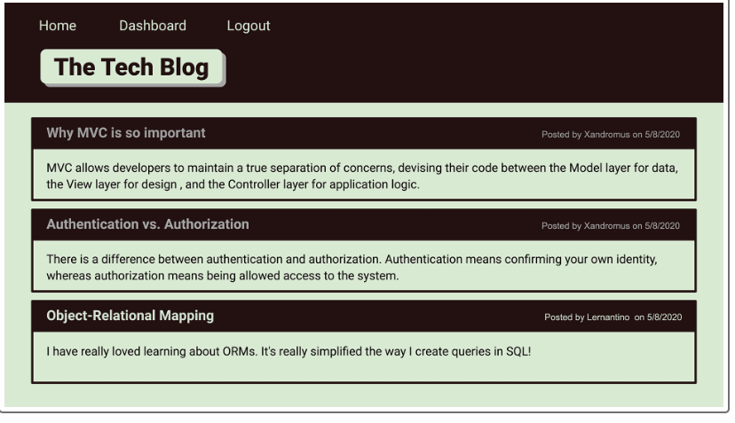

# techblogbyaj
Creates articles blog posts and opinions

NOTE:  This is a work in progress code.

This code is a code that connects the front and the back in together in which I am still in the process of learning.  

This code was taken from the mini project in module 14 in which I updated  and changed from the project to the blog and posts that will apply to this project.  I will continue to work on this project until get the desired results, however, as of know, this is what I am able to accomplish.

My code does not work, therefore I do not have an accurate image of what it actually looks like since it is a code in progress, but the image I have is what it is supposed to look like.  
